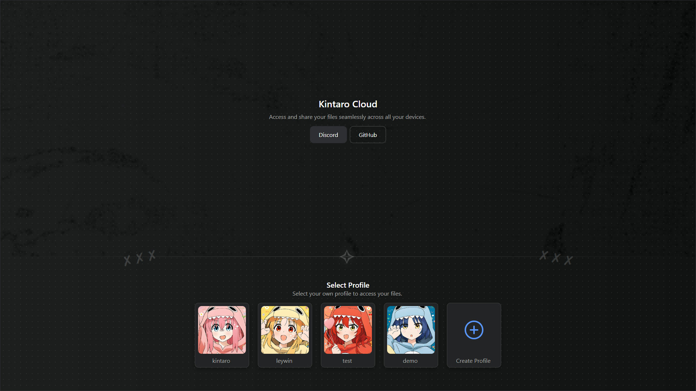
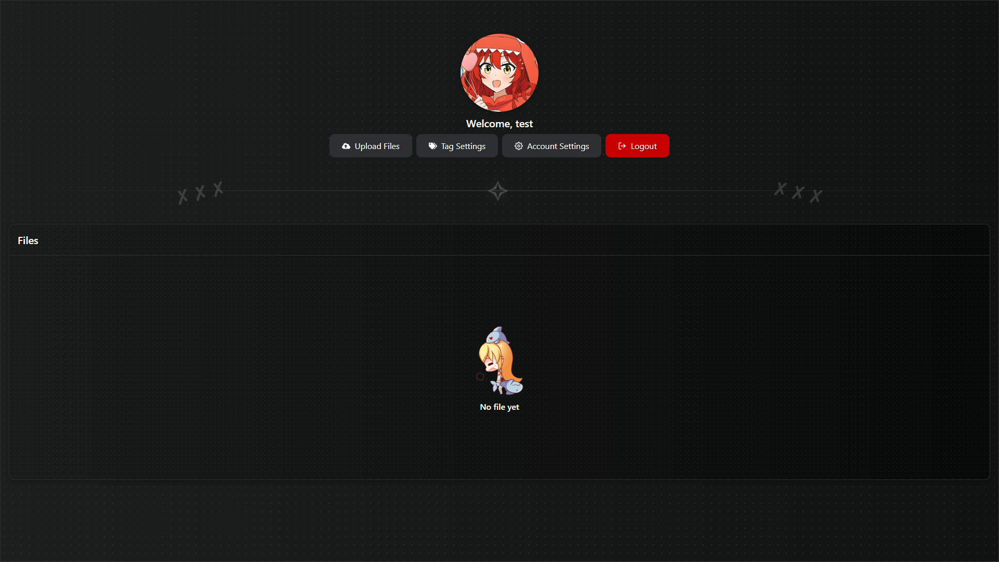
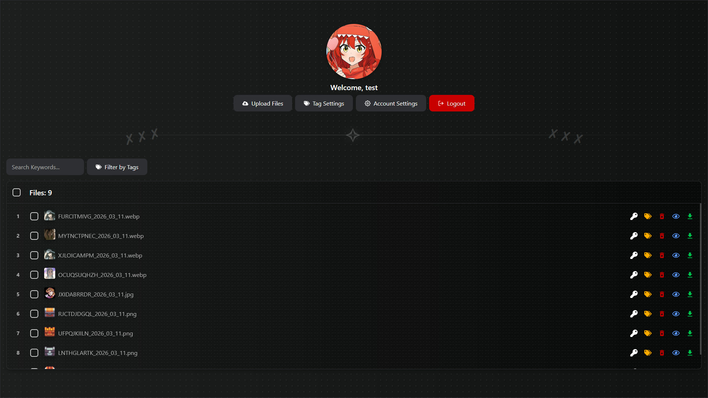

<a href="README.md">
 
</a>
<a href="README-TR.md">
 
</a>

  <br />
  <br />

<div align="center">
  

  <br />
  <br />

  <p>
    Anime Temalı, Güvenli ve Modern Kişisel Arşiv Sistemi
  </p>


  <p>
    <a href="#features">Özellikler</a> •
    <a href="#technologies">Teknolojiler</a> •
    <a href="#installation">Kurulum</a> •
    <a href="#license">Lisans</a> •
    <a href="#gallery">Galeri</a>
  </p>

  <br />
  <br />
</div>

## 📋 Hakkında

**Kintaro Cloud**, kendi yerel ağınızda kişisel arşivlerinizi profiller oluşturarak ve kategorilere ayırarak düzenli bir şekilde saklamanızı sağlayan, anime temalı modern ve şık bir arayüz sunar.



## ✨ Özellikler <a id="features"></a>

### Kullanıcı Yönetimi

- **Güvenli Kimlik Doğrulama**: Şifrelenmiş oturumlarla JWT tabanlı kimlik doğrulama sistemi.
- **Profil Özelleştirme**: Kullanıcı adınızı değiştirin, şifrelerinizi güncelleyin ve özel profil resimleri ayarlayın.
- **Çoklu Kullanıcı Hazır**: İzole dosya alanlarına sahip birden fazla hesabı destekler.

### Akıllı Organizasyon

- **Etiket Sistemi**: Arşivinizi verimli bir şekilde kategorize etmek için özel etiketler oluşturun ve atayın.
- **Anahtar Kelime Arama**: Anında keşif için dosyalara ayrıntılı anahtar kelimeler ekleyin.
- **Dinamik Filtreleme**: Dosyalarınızı kullanıcılara, etiketlere veya anahtar kelimelere göre gerçek zamanlı olarak filtreleyin.

### Medya Zekası

- **Otomatik Küçük Resimler**: **FFmpeg** kullanarak video dosyaları için otomatik olarak yüksek kaliteli küçük resimler oluşturur.
- **Tarayıcı İçi Görüntüleme**: `PDF`, `MP4`, `WEBM`, `JPG`, `PNG`, `MP3` ve daha fazlası için anında önizleme.
- **Dosya İstatistikleri**: Depolama kullanımını ve dosya boyutlarını bir bakışta izleyin.

### Toplu İşlemler

- **ZIP Dışa Aktarma**: Birden fazla dosya seçin ve bunları zaman damgalı tek bir ZIP arşivi olarak indirin.
- **Toplu Silme**: Disk temizliği ile birden fazla öğeyi bulutunuzdan güvenli bir şekilde kaldırın.
- **Çoklu Yükleme**: Büyük dosya gruplarını aynı anda yüklemek için sürükle ve bırak desteği.

## 🛠️ Teknolojiler <a id="technologies"></a>

### Backend

- **Node.js**: Yüksek eşzamanlı işlemler için çalışma zamanı motoru.
- **Express**: REST API için hızlı ve esnek web çerçevesi.
- **Multer**: Dosya yüklemelerini işlemek için sağlam ara yazılım.
- **Fluent-FFmpeg**: Medya işleme ve küçük resim çıkarma için güçlü sarmalayıcı.
- **Archiver**: Akış tabanlı ZIP oluşturma.

### Frontend

- **React 19**: En son eşzamanlılık özellikleriyle kullanıcı arayüzü oluşturma.
- **Vite**: Yıldırım hızında ön uç araçları ve derleme sistemi.
- **Kintaro-UI**: Kendi oluşturduğum UI kütüphanesi.
- **Axios**: API iletişimi için HTTP istemcisi.
- **React Icons**: Modern ikon kütüphanesi.

## 🚀 Kurulum <a id="installation"></a>

Projeyi yerel ortamınızda çalıştırmak için aşağıdaki adımları izleyin.

### Gereksinimler

- **Node.js** (v18+)
- **npm**

### Adım Adım Kurulum

1.  **Depoyu Klonlayın**

    ```bash
    git clone https://github.com/xkintaro/kintaro-cloud.git
    cd kintaro-cloud
    ```

2.  **Backend Bağımlılıklarını Yükleyin**

    ```bash
    cd backend
    npm install
    ```

3.  **Frontend Bağımlılıklarını Yükleyin**

    ```bash
    cd ../frontend
    npm install
    ```

4.  **Ortam Yapılandırması**  
    Her iki klasördeki `.env` dosyalarının yapılandırıldığından emin olun.

    **backend/.env**

    ```
    BACKEND_PORT=5088
    ```

    **frontend/.env**

    ```
    VITE_FRONTEND_API_URL=http://localhost:5088
    VITE_FRONTEND_PORT=5087
    ```

5.  **Backend Sunucusunu Başlatın**

    ```bash
    cd ../backend
    node index.js
    ```

6.  **Frontend Sunucusunu Başlatın**
    Yeni bir terminal açın:
    ```bash
    cd frontend
    npm run dev
    ```

## 📄 Lisans <a id="license"></a>

Bu proje MIT Lisansı altında lisanslanmıştır. Ayrıntılar için [LICENSE](LICENSE) dosyasını inceleyebilirsiniz.

## 🖼️ Galeri <a id="gallery"></a>



#



#

<p align="center">
  <sub>❤️ Developed by "Mustafa TAŞAL" (kintaro)</sub>
</p>
